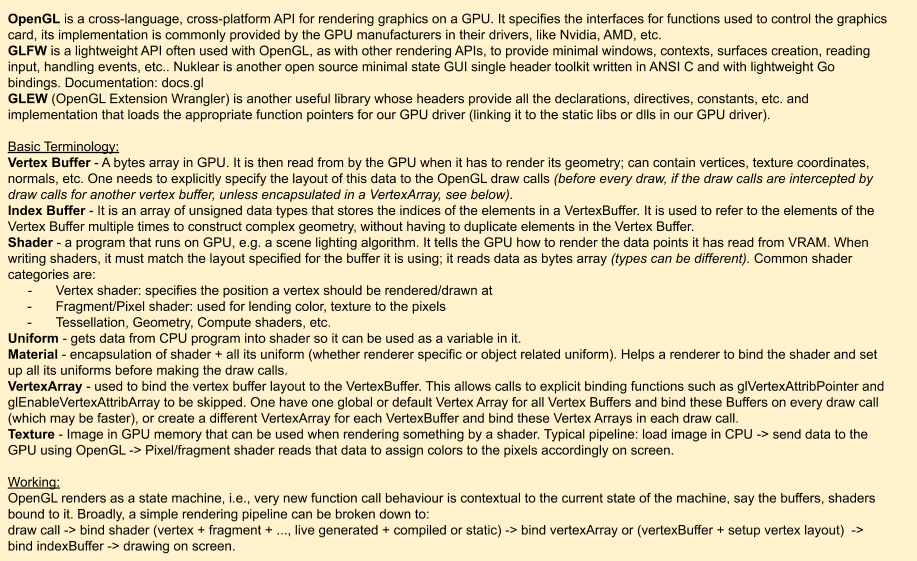

# My OpenGL notes
OpenGL summary and examples as I followed the OpenGL series from The Cherno's youtube channel (till video 16 in the [playlist](https://www.youtube.com/watch?v=W3gAzLwfIP0&list=PLlrATfBNZ98foTJPJ_Ev03o2oq3-GGOS2&pp=iAQB) as of 2023/04/03).

## Running the examples
1. Install OpenGL (`apt install libgl1-mesa-dev`), GLEW (`apt install libglew-dev`) and glfw3 (`apt install libglfw3-dev`) packages.
2. Run `cd src;mkdir build;cd build;cmake ..;make` and the desired binaries within created in the build dir, say `./renderer/renderer`, `./standalone_examples/VertexArray_Core_XVA` or `./standalone_examples/VertexArray_Compat_DefVA`, etc.
